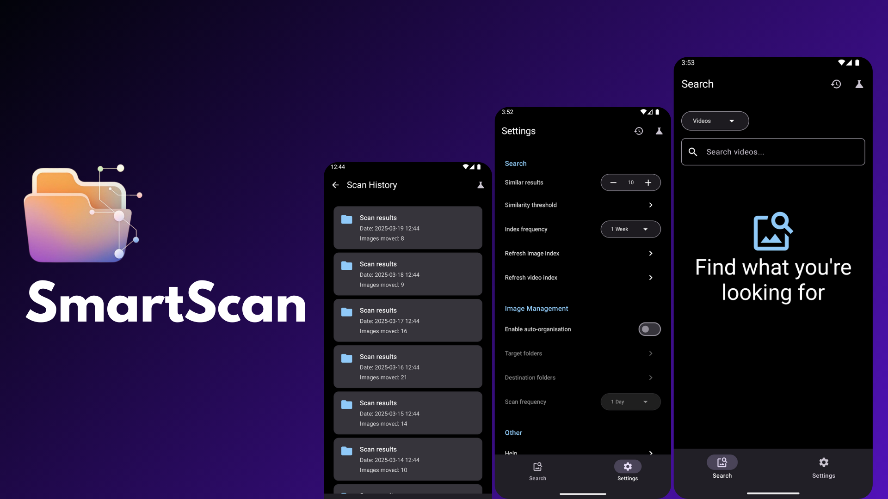
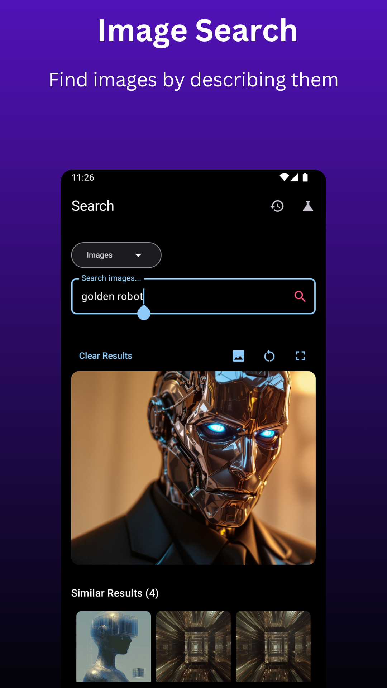
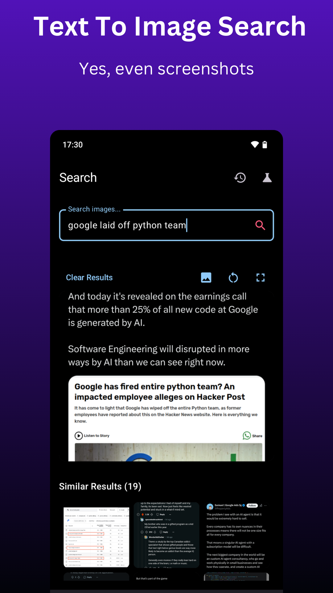
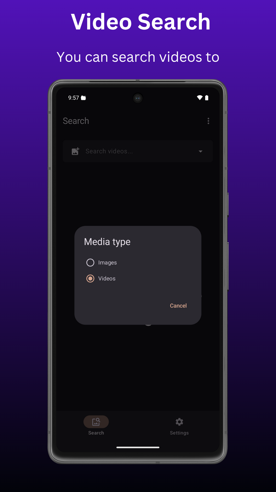
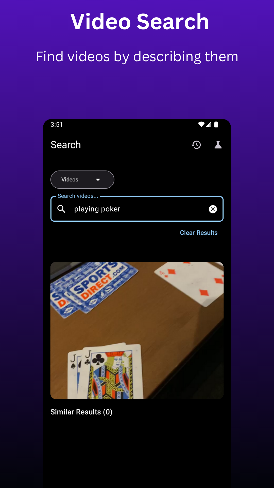
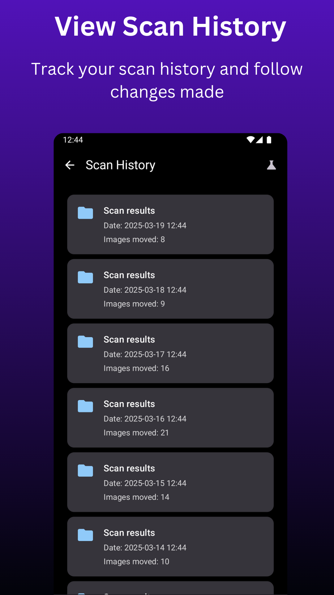
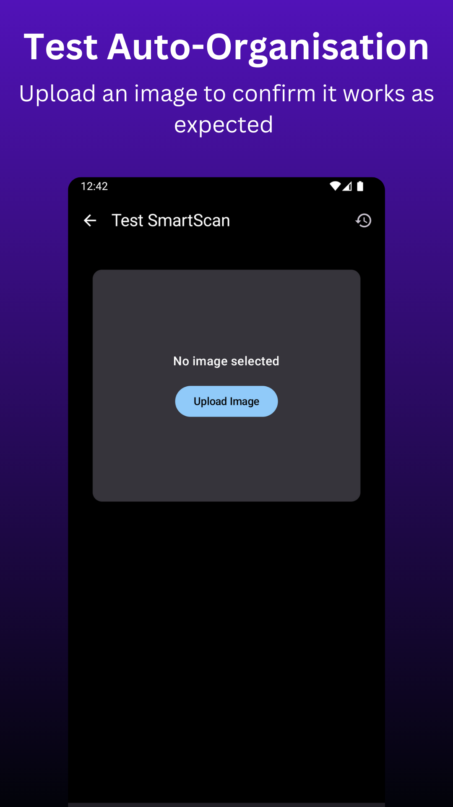
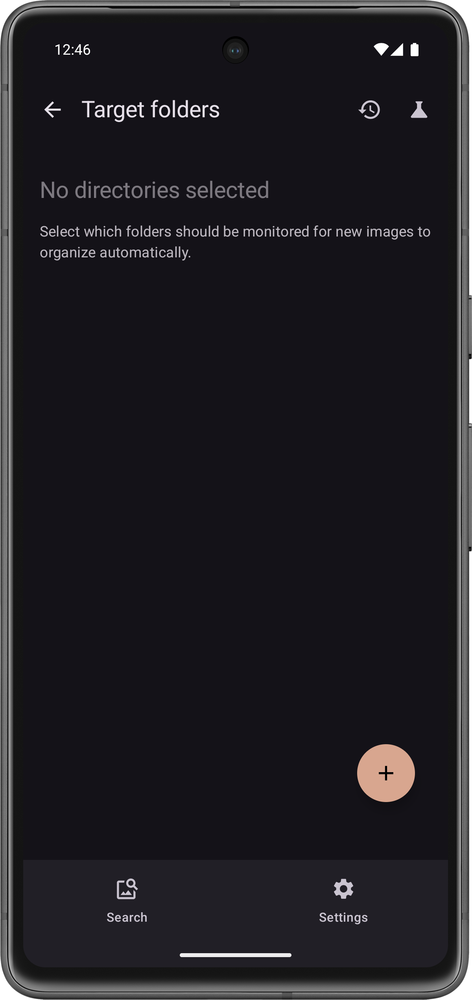
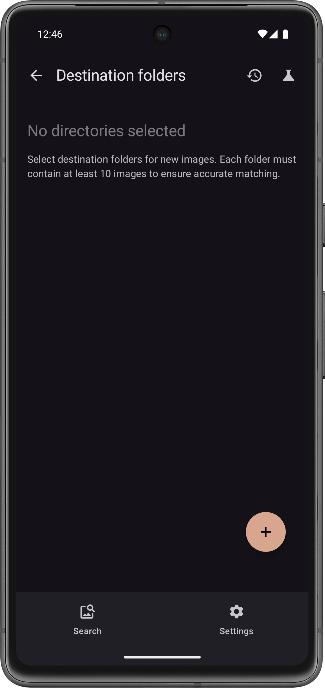

# SmartScan - Media organisation & search app

SmartScan is an innovative app powered by a CLIP model that automatically organizes your images by content similarity and enables text-based search across both images and videos, making gallery management effortless.

  

|  |  |  |
| --- | --- | --- |
|  |  |  |

---

## Key Features

### Automated Image Organisation
- **Auto-organisation:** Schedule regular scans automatically to organise images based on content similarity.
- **Auto-Categorisation Test:** Upload a test image to verify categorisation.
- **Undo Scans:** Revert the most recent scan if needed.

### Text-Based Video & Image Search
- **Gallery Access:** Open search results directly in the gallery.
- **Result Display:** Show the top result plus up to 20 similar images.
- **Weekly Updates:** Automatically refresh image and videos indexes for new images.

### Fully On-Device
All processing—including both image organisation and text-based search—is handled entirely on-device, ensuring privacy, speed, and offline functionality.

---

## How to use

### Image Management

1. **Target Folders**: In settings, select the folders you want to monitor for new images.
2. **Destination Folders**: In settings, select the allowed destination folders for images to be moved to.
3. **Test auto-organisation**: Once you have set this up you can test auto-categorisation by clicking the `test tube` icon and uploading an image. 

**Note:** Each destination folder should contain at least 10 well-curated images that accurately represent the types of images you expect to be moved there.

  
  

#### Limitations

- The accuracy of auto-categorization depends on the consistency of the sample images in each destination folder.
- False moves may occur if the images in a destination folder do not accurately represent the intended content.
- To minimize inaccuracies, ensure your destination folders are well-curated. If issues persist, **disable auto-organisation** and **open a GitHub issue**. Repeated issues might result in the removal of this feature.

### Media Search

Search across both images and videos with the following behavior:

* **First-Time Indexing:** First-time use requires indexing of media files. This may take several minutes depending on your library size.
* **Automatic Updates:** Indexing occurs automatically on a schedule (daily or weekly) based on your settings.
* **Manual Refresh:** You can also manually refresh the image or video index anytime via Settings.

#### Search Tips

- **Keep it Short**: Use short, specific search queries.
- **Be Descriptive**: For images with text content, include specific words present in the image.
- **Adjust Results**: In settings, you can modify the number of similar results displayed.

---

## Download

Go to [Releases](https://github.com/dev-diaries41/smartscan/releases/latest) and download the latest apk.

  

## Buy Me A Coffee

The app is free, but if you enjoy using it and want to support project development and maintenance, please consider donating using one of the options below:

| Wallet   | Address                              |
| -------- | ------------------------------------ |
| Bitcoin  | bc1qw46nxjp5gkh460ewamjd3jfeu0xv6ytq5et6xm        |
| Ethereum | 0xa53aC18B25942C71019f85314AF67F6132E525ad       |
| Litecoin | ltc1q2hspfea9rw5j2ymvv22hx7dmckh8c99sqk7av3       |

---

## License

 * This project is licensed under the GNU General Public License, Version 3 (GPLv3).
 * See the LICENSE file for details.

---
