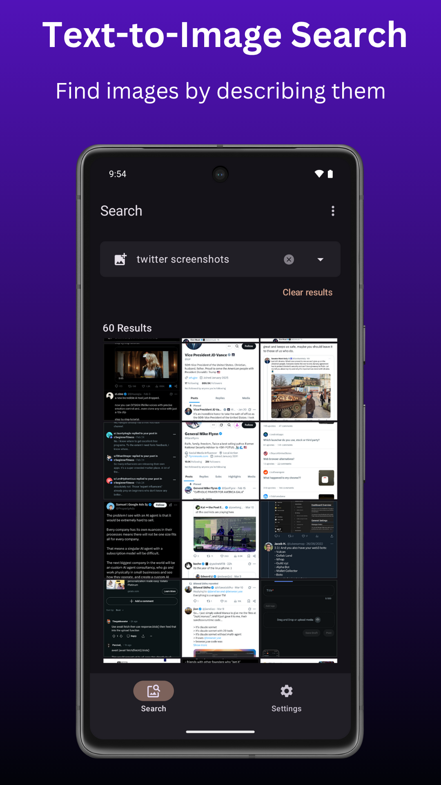

# SmartScan - Media search engine app

Search images and videos offline using text or by reverse image search with on-device AI.

  

|  |  |  |  |
|------------------------------------------------------------------------------------------------------------|------------------------------------------------------------------------------------------------------------|------------------------------------------------------------------------------------------------------------|------------------------------------------------------------------------------------------------------------|

---

## Buy Me A Coffee

The app is free, but if you enjoy using it and want to support project development and maintenance, please consider donating using one of the options below:

| Wallet   | Address                                     |
|----------|---------------------------------------------|
| Bitcoin  | bc1qw46nxjp5gkh460ewamjd3jfeu0xv6ytq5et6xm  |
| Ethereum | 0xa53aC18B25942C71019f85314AF67F6132E525ad  |
| Litecoin | ltc1q2hspfea9rw5j2ymvv22hx7dmckh8c99sqk7av3 |

---

## Key Features

### Search Images and Videos
- **Search Options:** Search using text or images.
- **Folder Selection:** Choose which image and video folders are allowed to be indexed.
- **Gallery Access:** Open search results directly in the gallery.
- **Weekly Updates:** Automatically refresh image and video indexes for new content.

### Fully On-Device
All processing is handled entirely on-device, ensuring privacy, speed, and offline functionality.

---

## How to use

### Media Search

Search across both images and videos with the following behavior:

* **First-Time Indexing:** First-time use requires indexing of media files. This may take several minutes depending on your library size.
* **Automatic Updates:** Indexing occurs automatically on a schedule (daily or weekly) based on your settings.
* **Manual Refresh:** You can also manually refresh the image or video index anytime via Settings.

#### Search Tips

- **Keep it Short**: Use short, specific search queries.
- **Be Descriptive**: For images with text content, include specific words present in the image.
- **Adjust Results**: In settings, you can modify the number of similar results displayed.

---

## Download

Go to [Releases](https://github.com/dev-diaries41/smartscan/releases/latest) and download the latest apk.

  

---

## License

 * This project is licensed under the GNU General Public License, Version 3 (GPLv3).
 * See the LICENSE file for details.

---
